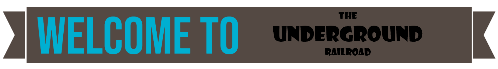
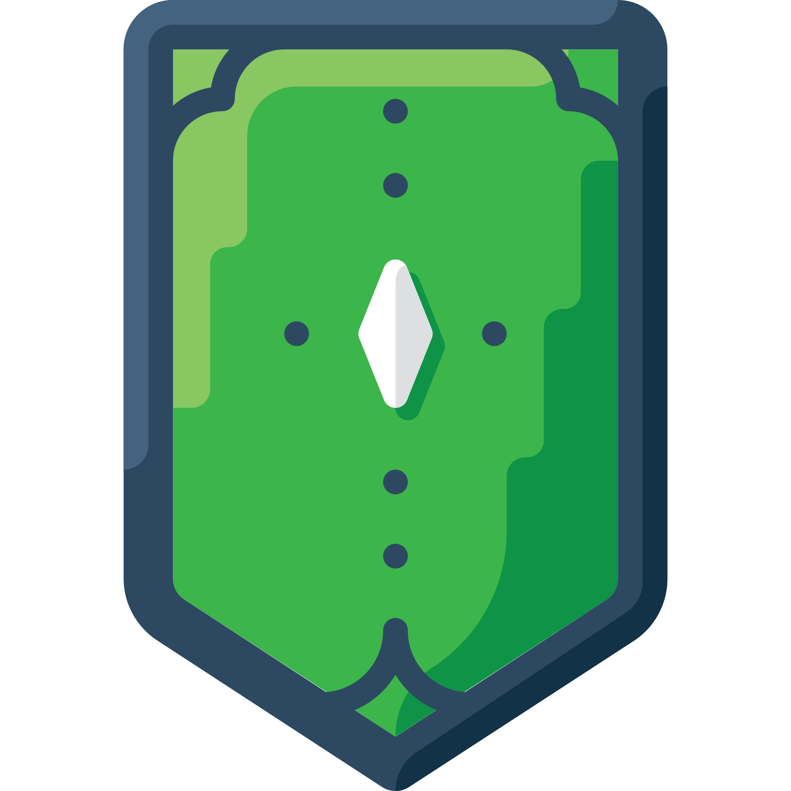
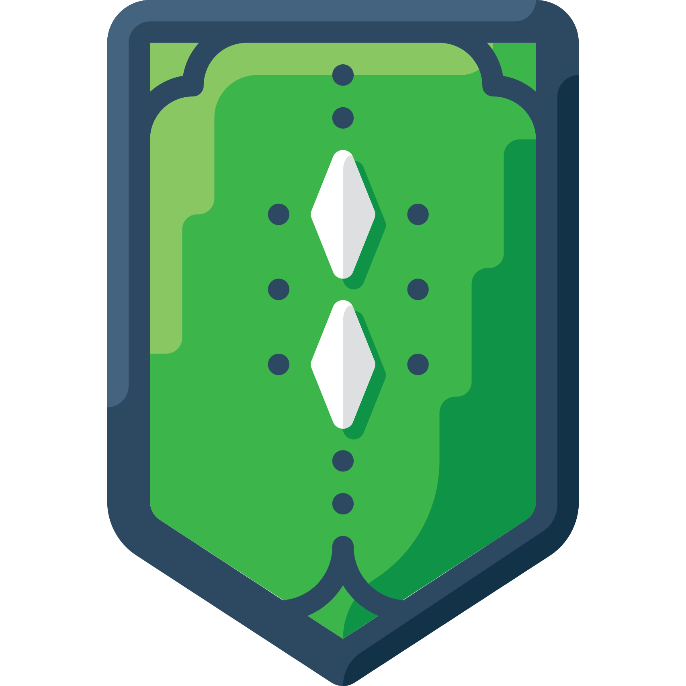
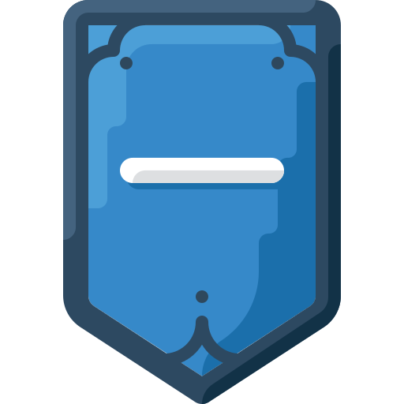
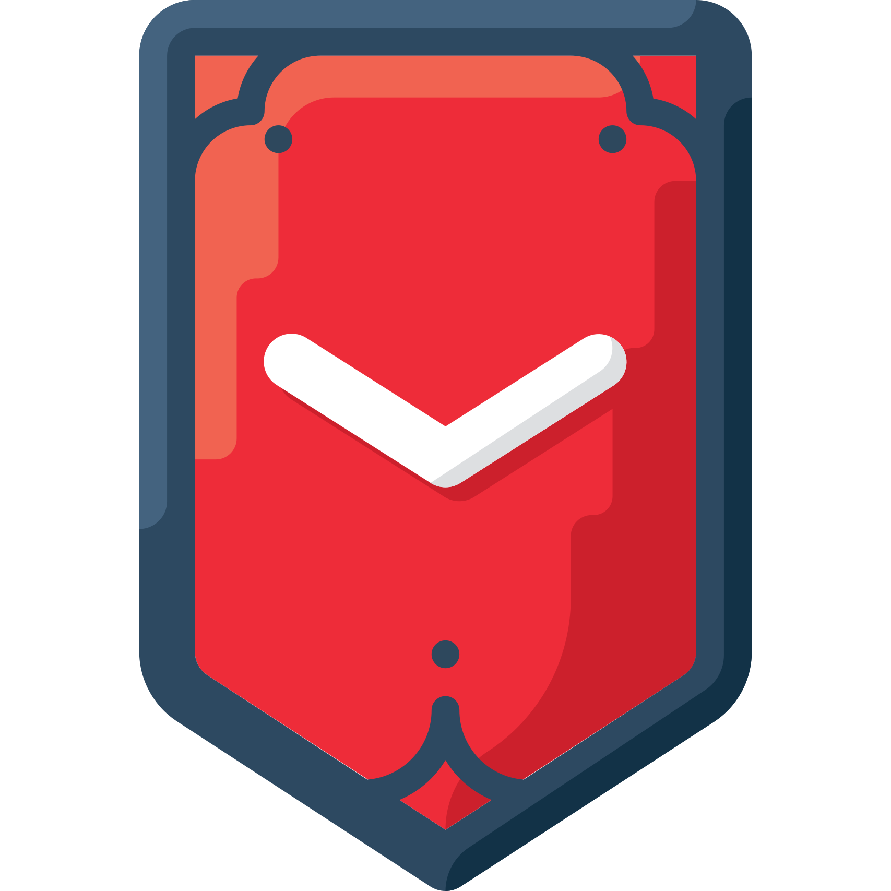
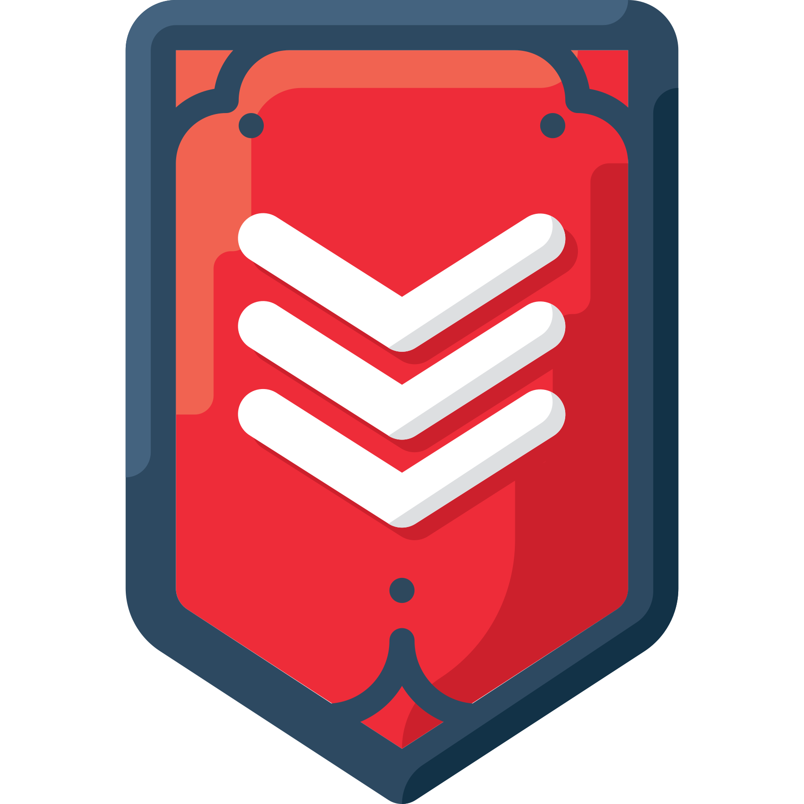
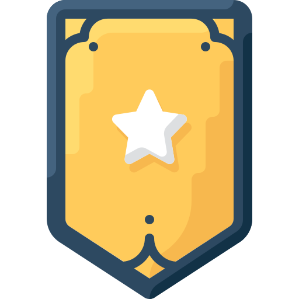
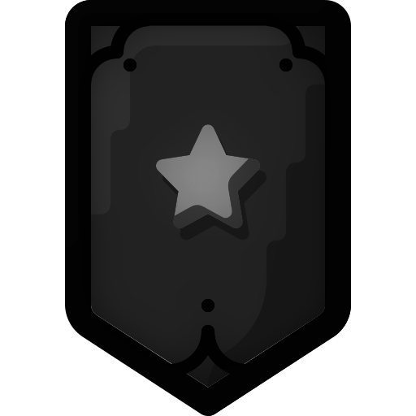

# [The Underground Railroad](https://chat.sokka.io)

 - [Intro](#weco)
 - [Install](#installationsetup)
 - [About](#about-information_source)
 - [Membership](#membership-beginner)
 - [Licence](#licence-copyright)
 - [Brief of The Project & Team](#brief-of-the-project--team)
 
---

&nbsp;

... a darknet chat with style 😏
---

Hey there! This is the repository for The Undergound Railroad, and this is the README file. Consider supporting my work by visiting and adding to the fun!

>**Disclaimer**: The Underground Railroad is available on (and designed for) Tor. It has a [v3 onion service](http://cboxkuuxrtulkkxhod2pxo3la25tztcp4cdjmc75wc5airqqliq2srad.onion/) which can only be accessed through the Tor Browser (or a tor configured browser/system), as well as a [clearnet url](https://chat.sokka.io/) which you can use on any browser.
>
>:warning: As such, there might occasionaly be questionable contributions made on the chat. I do not tolerate some and remove them as soon as possible. If you come accross material that offends or upsets you, do not panic. Just close it, wipe your browser cache (nothing google can't help you with), and continue like nothing happened. :warning:

## Installation/Setup
You'll need to have php with pdo, pcre, mbstring and date extension, and a web-server installed. You will also need the pdo_sqlite, pdo_mysql or pdo_pgsql extension, depending on which database you choose. Optionally, you can install:
 - the gd extension for the captcha feature
 - the json extension for save/restore
 - a memcached server and the memcached extension and change the configuration to use memcached. This will lessen the database load a bit.
 - a MySQL or PostgreSQL server to use as an external database instead of SQLite
 - the libsodium extension (PHP >= 7.2) for encryption of messages and notes in the database
 
When you have everything installed and use MySQL or PostgreSQL, you'll have to create a database and a user for the chat. Then edit the configuration at the bottom of the script to reflect the appropriate database settings and to modify the chat settings the way you like them. Then copy the script to your web-server directory and call the script in your browser with a parameter like this: `http://(server)/(script-name).php?action=setup`. Now you can create the Superadmin account. With this account you can administer the chat and add new members and set the guest access. As soon as you are done with the setup, all necessary database tables will be created and the chat can be used.

Note: If you updated the script, please visit `http://(server)/(script-name).php?action=setup` again, to make sure, that any database changes are applied and no errors occur.

## About :information_source:
This chat is part of The Onionz Project, developed by [@Dasho](https://dasho.dev). He manages it all through [hub@Onionz](https://hub.sokka.io).

It is a modern, and improved adaptation of [@DanWin's L.E - PHP chat](https://github.com/DanWin/le-chat-php). It has some added features and a lot of CSS upgrades. It works in full flow without JavaScript, which is it's design for use on Tor. It's just like the regular version... just better. If you plan on making it better... let me know. I'm always adding features and am currently working on a Git alternative that integrates directly with the chat. Sort of like GitHub and Gitter I guess, but also JavaScript free. All support is welcomed.

## Membership :beginner:
The chat is composed of various ranks of members. There are:
 - Guests 
 - Junior Members 
 - Senior Members 
 - Moderators 
 - Super Moderators 
 - Admins 
 - Super Admins 
 - Bot 

## Licence :copyright:
You can replicate, modify, and/or distribute this code, and others freely. You do not need to refer to me, but this is generally frowned upon. Personally though - I don't care.

:shield: **I do ask though** that you inform me of any security flaws/improvements you find or make to my work. This is important to help keep everyone safe. :shield:

## Brief of The Project & Team
### The Onionz Project :computer_mouse:
The Onionz Project is a web-project designed to make the web more accessible to everyone, while respecting their privacy and financial restrictions. Every thing that it provides is **FREE** and allows for **complete anonymity**, although you do need to smart about that yourself. It can be self-hosted for added privacy, and it’s package gets larger every day. (Or week, or month). The Onionz community host many different services, and welcomes everyone into it. It is focused on accessibility and freedom. It's that simple. You are welcome to contact Dasho @ [the chat](https://chat.sokka.io/)  if you have any questions at all regarding yourself and the internet.
